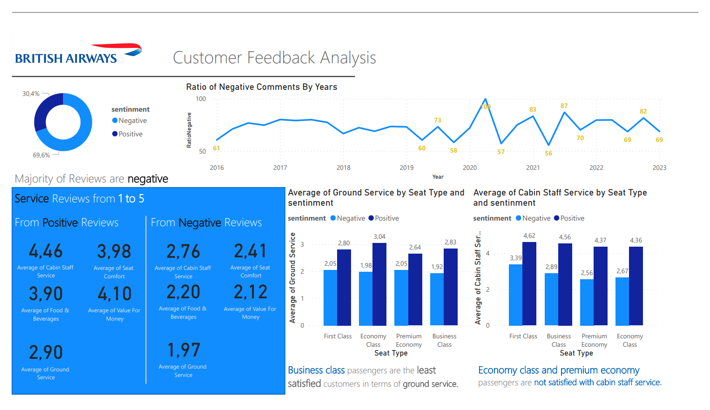
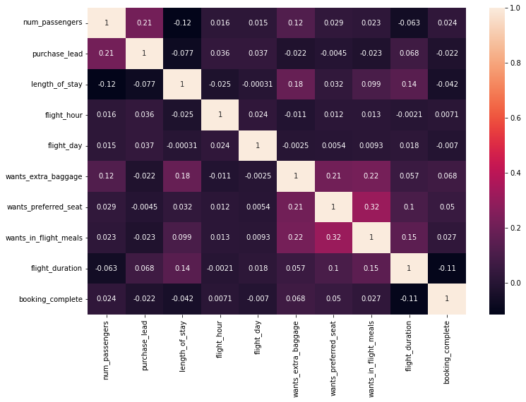

# customer_segmentation
KPMG Virtual Intership with Forage

# British Airways Sentiment Analysis Project

In the competitive airline industry, understanding customer sentiment is pivotal. This project dissects British Airways' customer feedback through advanced sentiment analysis, aiming to enhance the flying experience by pinpointing exactly what travelers applaud or criticize.

## Objective and Methodology

The central aim of the British Airways Sentiment Analysis Project is to conduct a forensic examination of customer feedback, extracting pivotal insights to decode satisfaction drivers and grievance sources. Leveraging the versatility of Python’s BeautifulSoup for web scraping, systematically **harvested over 3,400 customer reviews** from [airlinequality.com](https://www.airlinequality.com/airline-reviews/british-airways/). This dataset serves as the foundation for our nuanced analysis.

The granular review data was then meticulously classified into critical experiential categories—spanning aircraft type, travel class, and seat comfort, among others. This classification provided a structured multidimensional matrix critical for the depth of the sentiment analysis.

Subsequently, the data pipeline—encompassing a suite of natural language processing (NLP) tools—was deployed to quantify sentiment, **assigning each review a sentiment score**. This process transformed subjective feedback into quantifiable data, offering a spectrum of customer sentiment that shines a light on the service aspects most appreciated or admonished by passengers.

This integrative approach combines the precision of data science with the insights of qualitative analysis, positioning British Airways to strategically amplify service excellence.

## Key Technologies

- Sentiment Analysis
- NLP (Natural Language Processing)
- Data Mining
- Python
- Web Scraping
- Data Cleaning
- Text Classification
- Data Visualization

## Project Outputs

The dashboard of analysis results:

Here are some of the visualizations and results obtained from the analysis:

