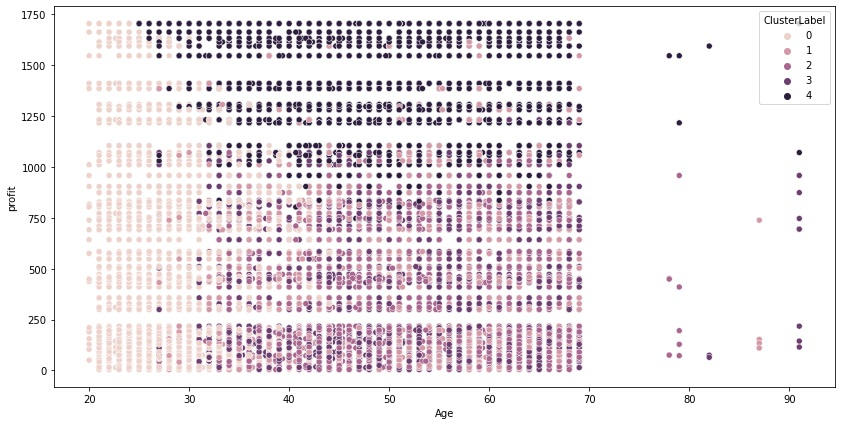
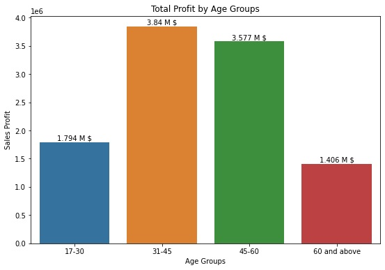
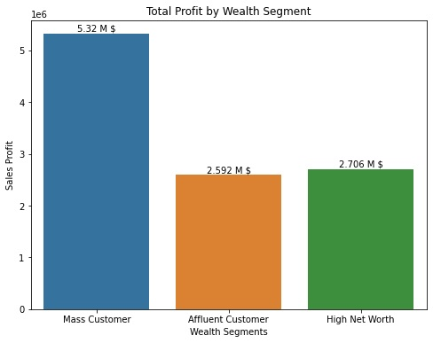
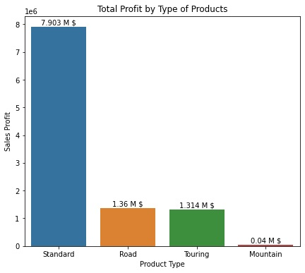

# Customer Segmentation Analysis for Targeted Marketing

## Objective and Methodology

This project aims to enhance the Bicycle Company's marketing strategy by leveraging data-driven insights from customer trends and behaviors. The goal is to identify and recommend the most valuable 1000 new customers to target, maximizing value for the organization.

### Datasets Utilized
- Transactions Data
- Customer Demographic Information
- Customer Address Records
- New Customer List

### Analytical Approach

#### Data Exploration
This foundational phase involves data quality assessment, management of missing data through imputation techniques, and exploratory data analysis (EDA) using statistical and visual tools.

#### Model Development
Implementation of a K-Means clustering algorithm to achieve precise customer segmentation based on critical customer attributes.

#### Interpretation
Deep analysis of each customer cluster, focusing on the most profitable segments to tailor strategic marketing initiatives, and translating this analysis into actionable recommendations for customer acquisition.

## Key Findings
- Age groups **31-45 and 45-60** are the most profitable segments.
- Significant contributors to overall sales profitability include the mass customer segment and the industries of manufacturing and financial services.
- **Standard product types** dominate transaction volumes, while touring bikes yield the highest average profit margin.
- Brand analysis reveals WeareA2B commands superior total and average profits, surpassing Solex's sales volume.

## Strategic Recommendations
- **Customer Acquisition:** Focus on middle-aged and older adults, adapting marketing strategies to their preferences.
- **Customer Retention:** Engage with low-frequency purchasers to capitalize on their substantial yet sporadic spending.

## Segmentation Insights

| ClusterLabel | Past 3 Years Bike Related Purchases | Age  | Tenure | Property Valuation | Profit Sum      | Profit Mean | Owns Car | Affluent Customer | High Net Worth | Mass Customer |
|--------------|------------------------------------|------|--------|--------------------|-----------------|-------------|----------|-------------------|----------------|---------------|
| Cluster 0    | 50.3                               | 28.8 | 3.8    | 7.7                | $2,095,120.50   | $493.20     | 0.5      | 0.3               | 0.2            | 0.5           |
| Cluster 1    | 46.5                               | 49.1 | 12.6   | 3                  | $1,281,487.90   | $432.80     | 0.4      | 0.2               | 0.3            | 0.5           |
| Cluster 2    | 24.3                               | 50.2 | 13.1   | 8.8                | $1,557,879.00   | $324.20     | 0.5      | 0.2               | 0.2            | 0.5           |
| Cluster 3    | 77.5                               | 49.7 | 12.4   | 8.8                | $1,471,544.70   | $353.10     | 0.5      | 0.2               | 0.3            | 0.5           |
| **Cluster 4**| **48.3**                           | **48**| **12.1**| **7.9**          | **$4,211,035.60**| **$1,374.80**| **0.5** | **0.2**           | **0.3**        | **0.5**       |

- **Cluster 4:** Most valuable segment due to frequent purchases, higher property valuation, and profitability.
- **Cluster 0:** Young, affluent customers with significant spending power.
- **Cluster 2:** Less frequent purchasers but with considerable profit contributions.

## Conclusion

The integration of customer data analytics and machine learning has resulted in actionable insights for the company, enabling data-driven decision-making for marketing resource allocation and customer engagement strategies.

### Technologies and Techniques
- Data Clustering
- Data Visualization
- Machine Learning
- Statistical Analysis
- Predictive Modeling
- Customer Analytics
- Data Wrangling
- Business Intelligence
